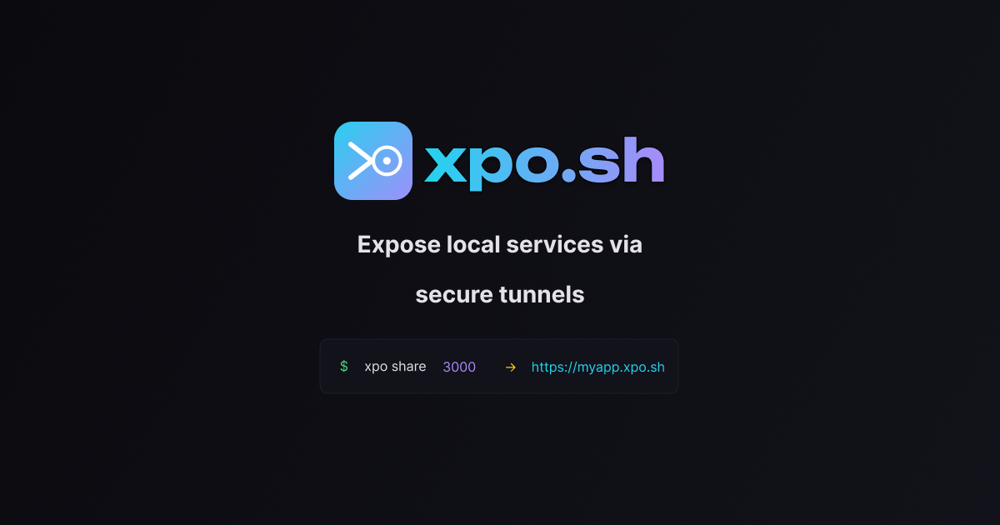

<p align="center">
  <a href="https://xpo.sh"></a>
</p>

<p align="center">
  <a href="https://xpo.sh"></a>
  <a href="https://crates.io/crates/xpo"></a>
  <a href="https://www.npmjs.com/package/@xposh/cli"></a>
  <a href="https://github.com/xpo-sh/xpo/actions"></a>
  <a href="https://github.com/xpo-sh/xpo/blob/main/LICENSE"></a>
  <a href="https://github.com/xpo-sh/xpo"></a>
</p>

<p align="center">
  Open-source tunneling tool that exposes local services to the internet via secure HTTPS tunnels.<br>
  Built in Rust for maximum performance. Alternative to ngrok and Cloudflare Tunnel.
</p>

---

- [Install](#install)
- [Public Tunnels](#public-tunnels)
- [Local HTTPS](#local-https)
- [Why xpo?](#why-xpo)
- [Features](#features)
- [Commands](#commands)
- [Platform Support](#platform-support)
- [Contributing](#contributing)
- [License](#license)

## Install

```bash
curl -fsSL https://xpo.sh/install | sh
```

<details>
<summary>Other methods</summary>

```bash
# Homebrew
brew install xpo-sh/tap/xpo

# npm
npm install -g @xposh/cli

# From source
cargo install xpo
```

</details>

## Public tunnels

Expose any local port to the internet with a single command:

```bash
$ xpo login
  ✓ Logged in as you@email.com

$ xpo share 3000
  ╭───────────────────────────────────────────╮
  │                                           │
  │  xpo share                                │
  │                                           │
  │  https://a1b2c3.xpo.sh -> localhost:3000  │
  │                                           │
  │  you@email.com - Ctrl+C to stop           │
  │                                           │
  ╰───────────────────────────────────────────╯

  GET  /           200   12ms
  GET  /_nuxt/     101   42ms
  GET  /api/data   200    8ms

$ xpo share 3000 -s myapp
  https://myapp.xpo.sh -> localhost:3000
```

## Local HTTPS

Real HTTPS on localhost with `.test` domains. No browser warnings, WebSocket/HMR works out of the box. Setup runs automatically on first use:

```bash
$ xpo dev 3000 -n myapp
  → Running first-time setup...
  ✓ Root CA created (P-256 ECDSA, 10yr)
  ✓ CA trusted in system keychain
  ✓ Port forwarding active  443→10443, 80→10080

  https://myapp.test -> localhost:3000

  GET / 200 12ms
  GET /_nuxt/ 101 42ms
```

## Why xpo?

| | xpo | ngrok | Cloudflare Tunnel |
|---|---|---|---|
| Open source | ✅ MIT (client + server) | ❌ Proprietary | ⚠️ Client only (Apache 2.0) |
| Self-hostable | ✅ | ❌ | ❌ |
| Local HTTPS | ✅ `.test` domains | ❌ | ❌ |
| Custom subdomains | ✅ | 💰 Paid | ✅ |
| Written in | Rust | Go | Go |
| Binary size | ~5 MB | ~30 MB | ~40 MB |
| WebSocket relay | ✅ | ✅ | ✅ |

## Features

- **HTTPS tunnels** -Let's Encrypt wildcard TLS, zero config
- **WebSocket relay** -HMR/hot-reload works through tunnel
- **Local HTTPS** -trusted `.test` domains for development
- **Auto-reconnect** -exponential backoff on connection loss
- **Request logging** -colored terminal output with timing
- **Custom subdomains** -`xpo share 3000 -s myapp`
- **GitHub/Google auth** -OAuth login, no email/password
- **Fast** -Rust + tokio, sub-millisecond proxy overhead
- **Open source** -MIT licensed

## Commands

```bash
xpo login                   # authenticate with GitHub or Google
xpo share <port>            # public HTTPS tunnel
xpo share <port> -s <name>  # custom subdomain
xpo dev <port> -n <name>    # local HTTPS proxy (auto-setup on first use)
xpo dev setup               # manual setup (CA, trust, port forwarding)
xpo dev doctor              # diagnose setup issues
xpo dev stop                # clean up /etc/hosts entries
xpo dev uninstall           # remove CA, trust, and port forwarding
xpo status                  # show session info
xpo logout                  # clear session
```

## Platform support

| Platform | `xpo dev` | `xpo share` |
|---|---|---|
| macOS (ARM + Intel) | ✅ Full | ✅ Full |
| Linux (x86_64 + ARM) | ✅ Full | ✅ Full |
| Windows | -| ✅ Full |

## Contributing

We welcome contributions! Here's how you can help:

- 🐛 [Report bugs](https://github.com/xpo-sh/xpo/issues/new?template=bug_report.md)
- 💡 [Request features](https://github.com/xpo-sh/xpo/issues/new?template=feature_request.md)
- 🔧 [Submit a PR](https://github.com/xpo-sh/xpo/pulls)

## License

[MIT](LICENSE)

<p align="center">
  <sub>
    <a href="https://xpo.sh">Website</a> · <a href="https://x.com/getxposh">X/Twitter</a> · <a href="https://github.com/xpo-sh">GitHub</a>
  </sub>
</p>
